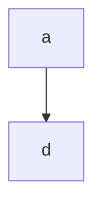
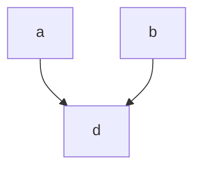
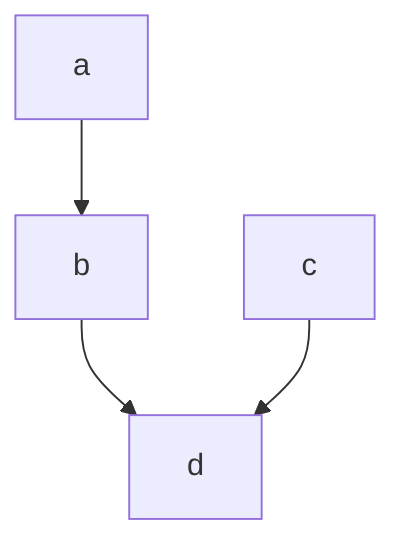
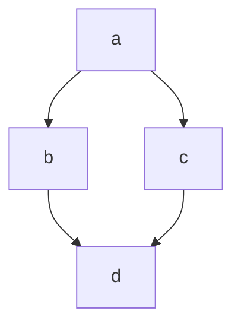
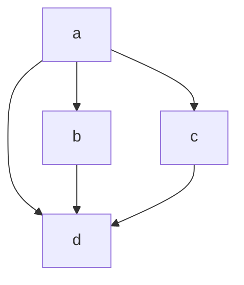

# @crikey/json

JSON types and utility functions

See [@crikey/json](https://whenderson.github.io/json-mono/modules/_crikey_json.html) for full documentation.

## API

### Types
Contains types used to represent JSON and JSON equivalents.

Primary types:
* {@link Json} - A pure JSON type. Contained values may not be undefined.
* {@link Jsonish} - A JSON type which allows for contained values to be undefined.

### Guards
Contains typescript guards for identifying type information.

* {@link is_undefined} returns true if value is undefined
* {@link is_null} returns true if value is null
* {@link is_boolean} returns true if value is a boolean 
* {@link is_integer} returns true if value is an integer
* {@link is_safe_integer} returns true if value is a safe integer
* {@link is_index_number} returns true if value is a positive integer
* {@link is_index_string} returns true if value is the string equivalent of a positive integer 
* {@link is_index_number_or_string} returns true if either {@link is_index_number} or {@link is_index_string} is true
* {@link is_number} returns true if value is a number
* {@link is_finite_number} returns true if value is a finite number
* {@link is_string} returns true if value is a string
* {@link is_primitive} returns true if value is a json primitive
* {@link is_encodable_primitive} returns true if value is an encodable primitive
* {@link is_object} returns true if value is an object (but not an array)
* {@link is_array} returns true if value is an array
* {@link is_container} returns true if either {@link is_object} or {@link is_array} is true
* {@link is_json} returns true if a shallow check of value confirms a json type 
* {@link is_json_deep} returns true if a deep check of value confirms
* {@link is_encodable_json} returns true if
* {@link is_encodable_json_deep} returns true if
* {@link is_equal_deep} returns true if

TODO: equal_deep needs jsonish equivalent where keys with undefined != missing key
TODO: actually 3 equals, undefined === missing, undefined !== missing, and no check for undefined (assumed everything is defined)

### Access
### Traversal
### Utilities


* {@link constant} - Create a {@link Readable} store with a fixed value
* {@link readable} - Create a {@link Readable} store
* {@link writable} - Create a {@link Writable} store
* {@link derive}   - Create a {@link Readable} store derived from the resolved values of other stores
* {@link transform}- Create a {@link Writable} store by applying transform functions when reading and writing values

### Utility functions:
* {@link get} - Retrieve the value of a store
* {@link read_only} - Restrict a store to the {@link Readable} interface

### Type guards:
* {@link is_writable} Type guard to determine if store is {@link Writable}
* {@link is_readable} Type guard to determine if store is {@link Readable}

### Trigger functions:
* {@link trigger_always} - Trigger at every available opportunity
* {@link trigger_strict_not_equal} - Trigger based on strict inequality
* {@link trigger_safe_not_equal} - Svelte compatible trigger - Trigger when not equal or value is complex

## Installation

```bash
# pnpm
$ pnpm add @crikey/stores-base

# npm
$ npm add @crikey/stores-base

# yarn
$ yarn add @crikey/stores-base
```

## Usage

This package is predominantly intended for internal use.

See individual APIs for strict usage instructions or browse the unit tests and usage from other packages in the mono repository. 

## Differences with Svelte stores

### Definable trigger semantics
Svelte stores use a greedy change detection system to, whereby complex types are always considered to have changed.

e.g.
```ts
import { writable } from 'svelte/store';

const value = {};
const store = writable(value);
store.subscribe(value => console.log('changed'));
store.set(value);

// > changed
// > changed
```

`@crikey/stores-base` stores allow for user defined trigger functions. This trigger function is
called for each {@link Writable.set} and {@link Writable.update} call, allowing for user defined 
comparisons between the old value and the new value to determine if subscribers should be notified.

e.g.
{@codeblock ./examples/writable.test.ts#example-writable-trigger}

### Asynchronous `update` as well as `set`

@crikey stores extend the {@link readable}, {@link writable}, and {@link derive} signatures
allowing calculations to asynchronously `update` as well as `set` their values.

e.g.
{@codeblock ./examples/derive.test.ts#example-derive-async-update}

### Subscriber execution order
In order to ensure reliable and predictable execution order for subscribers, stores utilize an internal action queue.
Whenever a store is changed, its active subscriptions are pushed onto a queue and executed in order. If more changes
result in more subscriptions being pushed onto the queue, they are added to the end of the current queue and everything
continues to be executed in FIFO order.

Svelte does not expose this queue and thus extensions are not able to maintain a pure FIFO order when mixed.

As a natural result, when mixing svelte stores and `@crikey/stores`, execution order will not be strictly FIFO.

### Unlimited dependencies
To avoid erroneous recalculations, {@link derive} store types keep track of which inputs are being
recalculated (see _Premature evaluation_ below). `@crikey/stores-base` determines the most efficient approach
to this problem based on the number of inputs required.

`svelte` store implementation details use a fixed tracking system allowing for a maximum of 32 inputs. Additional
inputs beyond this number will begin to behave incorrectly.

Note that this is an implementation detail and as such is likely to be improved at some point.

### Premature evaluation
Ensuring a derived store value is evaluated against up-to-date inputs is non-trivial.

From the below examples, svelte and @crikey are comparable except for (e) where svelte stores may erroneously calculate
a derived value based off of atrophied inputs.

Some examples:

_a) Simple single dependency_
* As soon as `a` changes, `d` is recalculated.


_b) Simple dual dependency_
* As soon as `a` or `b` changes, `d` is recalculated.


_c) Simple chained dependency_
* As soon as `a` changes, `b` is recalculated.
* As soon as `b` or `c` changes, `d` is recalculated.


_d) Diamond dependency_
* As soon as `a` changes, `b` and `c` are recalculated.
* As soon as `b` or `c` changes, `d` is recalculated.



e) Diamond+ dependency
* As soon as `a` changes, `b`, `c`, and `d` are recalculated.
* As soon as `b` or `c` changes, `d` is recalculated.

_svelte_:
A change to `a` may result in `d` being recalculated multiple times, sometimes using partially atrophied data from its
dependencies.

_@crikey_:
A change to `a` will at most result in `d` being recalculated once, after all its dependencies have been resolved.


### Infinite recursion checks
Subscribing to a store from within its start function triggers a RecursionError rather returning the initial_value

### Error handling
Uncaught errors in subscribers, start functions or derivation functions can now be handled via @{link set_store_runner}

